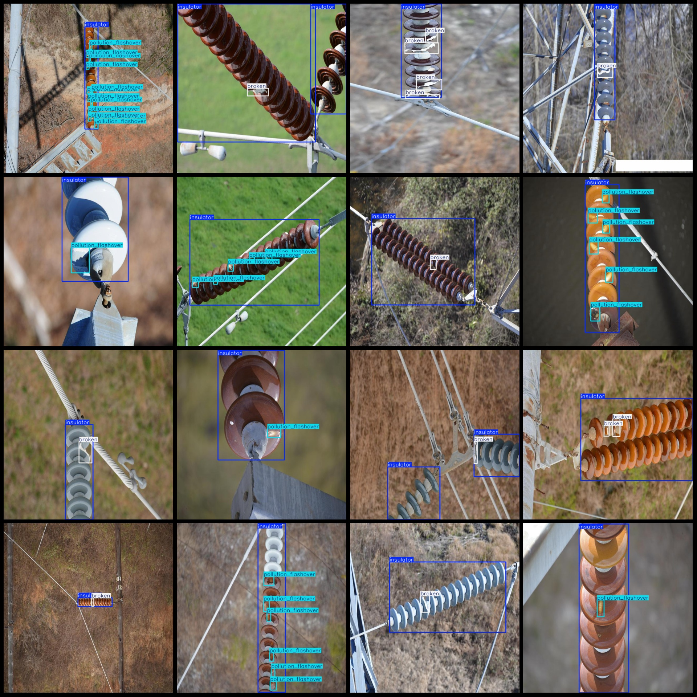

# Power Scene Insulator Defect Identification and Detection Dataset (VOC+YOLO)

## Dataset Format: Pascal VOC format + YOLO format (txt file without split path, only contains jpg images and corresponding VOC format xml files and yolo format txt files)

Number of Images (jpg file count): 1598
Number of Annotations (xml file count): 1598
Number of Annotations (txt file count): 1598
Number of Annotation Categories: 3
Repository: firc-dataset
Annotation Category Names: ["broken", "insulator", "pollution_flashover"]

Each category has the following number of bounding boxes:
- broken: 1092
- insulator: 1830
- pollution_flashover: 2448
Total bounding box count: 5370

Annotation tool used: labelImg
Annotation rules: Drawing rectangles around the categories

Image resolution: 640x640

Dataset enhancement: Yes, about one third is original images, the rest are enhanced images

Important Notes: None
Special Statements: This dataset does not guarantee the accuracy of the trained models or weight files.

Image Preview:

## Images

Here is a pay link on Stripe ( https://buy.stripe.com/3cs8yP7sY87d0vu9AB ). Please contact me lonlonago@foxmail.com after funding $89, and I will send you a complete data files , thank you!

